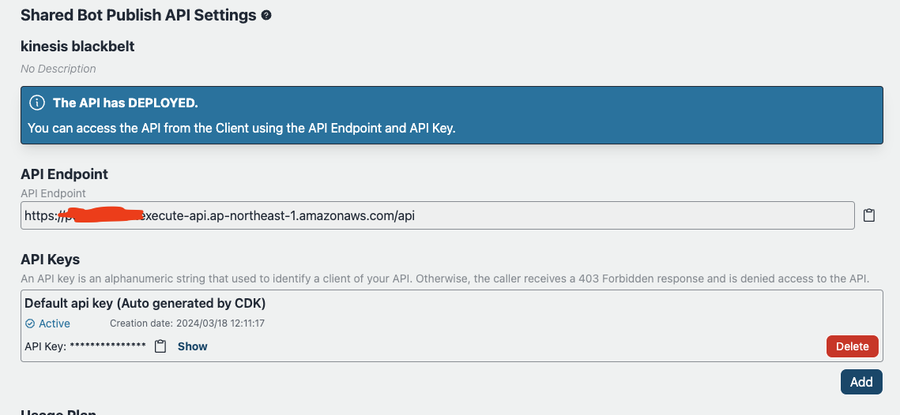

# Penerbitan API

## Gambaran Keseluruhan

Sampel ini termasuk fitur untuk menerbitkan API. Walaupun antara muka sembang boleh menjadi mudah untuk pengesahan awal, pelaksanaan sebenar bergantung kepada kes penggunaan khusus dan pengalaman pengguna (UX) yang diinginkan untuk pengguna akhir. Dalam beberapa senario, antara muka sembang mungkin menjadi pilihan yang lebih disukai, manakala dalam senario lain, API bebas mungkin lebih sesuai. Selepas pengesahan awal, sampel ini menyediakan keupayaan untuk menerbitkan bot tersuai mengikut keperluan projek. Dengan memasukkan tetapan untuk kuota, pengawal aliran, asal, dan sebagainya, titik akhir dapat diterbitkan bersama kunci API, menawarkan fleksibiliti untuk pilihan integrasi yang pelbagai.

## Keselamatan

Menggunakan hanya kunci API tidak disarankan seperti yang diterangkan dalam: [Panduan Pembangun AWS API Gateway](https://docs.aws.amazon.com/apigateway/latest/developerguide/api-gateway-api-usage-plans.html). Oleh itu, contoh ini melaksanakan sekatan alamat IP yang mudah melalui AWS WAF. Peraturan WAF digunakan secara umum di seluruh aplikasi kerana pertimbangan kos, dengan andaian bahawa sumber yang ingin disekat berkemungkinan sama merentasi semua API yang dikeluarkan. **Sila patuhi polisi keselamatan organisasi anda untuk pelaksanaan sebenar.** Lihat juga bahagian [Seni Bina](#architecture).

## Cara Menerbitkan Bot API yang Disesuaikan

### Prasyarat

Atas sebab-sebab tadbir urus, hanya pengguna terhad yang boleh menerbitkan bot. Sebelum menerbitkan, pengguna mesti menjadi ahli kumpulan yang dipanggil `PublishAllowed`, yang boleh disediakan melalui konsol pengurusan > Amazon Cognito User pools atau aws cli. Ambil perhatian bahawa ID kumpulan pengguna boleh dirujuk dengan mengakses CloudFormation > BedrockChatStack > Outputs > `AuthUserPoolIdxxxx`.

### Tetapan Penerbitan API

Selepas log masuk sebagai pengguna `PublishedAllowed` dan membuat bot, pilih `API PublishSettings`. Ambil perhatian bahawa hanya bot yang dikongsi boleh diterbitkan.

Pada skrin berikutnya, kita boleh mengkonfigurasi beberapa parameter berkaitan dengan pencekikan. Untuk butiran lanjut, sila lihat: [Pencekikan Permintaan API untuk Keluaran yang Lebih Baik](https://docs.aws.amazon.com/apigateway/latest/developerguide/api-gateway-request-throttling.html).

Selepas pengplotan, skrin berikut akan muncul di mana anda boleh mendapatkan URL endpoint dan kunci API. Kita juga boleh menambah dan membuang kunci API.

## Seni Bina

API diterbitkan seperti diagram berikut:

WAF digunakan untuk pembatasan alamat IP. Alamat dapat dikonfigurasi dengan menetapkan parameter `publishedApiAllowedIpV4AddressRanges` dan `publishedApiAllowedIpV6AddressRanges` dalam `cdk.json`.

Setelah pengguna mengklik terbitkan bot, [AWS CodeBuild](https://aws.amazon.com/codebuild/) memulai tugas penyebaran CDK untuk menyediakan tumpukan API (Lihat juga: [Definisi CDK](../cdk/lib/api-publishment-stack.ts)) yang berisi API Gateway, Lambda, dan SQS. SQS digunakan untuk memisahkan permintaan pengguna dan operasi LLM karena menghasilkan keluaran dapat melebihi 30 detik, yang merupakan batas kuota API Gateway. Untuk mengambil keluaran, perlu mengakses API secara asinkron. Untuk lebih jelasnya, lihat [Spesifikasi API](#api-specification).

Klien perlu menetapkan `x-api-key` pada header permintaan.

## Spesifikasi API

Lihat [di sini](https://aws-samples.github.io/bedrock-chat).