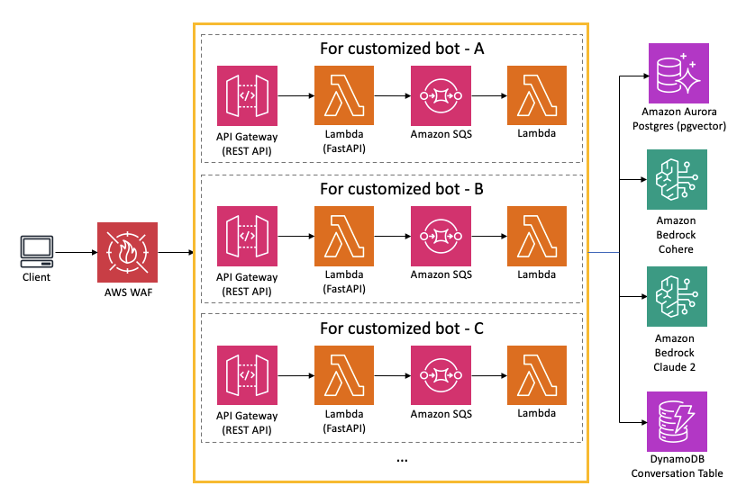

# การเผยแพร่ API

## ภาพรวม

ตัวอย่างนี้มีคุณสมบัติสำหรับการเผยแพร่ API โดยที่อินเทอร์เฟซแชทอาจสะดวกสำหรับการตรวจสอบเบื้องต้น แต่การนำไปใช้งานจริงขึ้นอยู่กับกรณีการใช้งานเฉพาะและประสบการณ์ผู้ใช้ (UX) ที่ต้องการสำหรับผู้ใช้ปลายทาง ในบางสถานการณ์ UI แบบแชทอาจเป็นตัวเลือกที่เหมาะสม ในขณะที่ในกรณีอื่นๆ API แบบสแตนด์อโลนอาจเหมาะสมกว่า หลังจากการตรวจสอบเบื้องต้น ตัวอย่างนี้มีความสามารถในการเผยแพร่บอทที่กำหนดเองตามความต้องการของโครงการ โดยการป้อนการตั้งค่าโควตา การจำกัดความเร็ว แหล่งที่มา ฯลฯ จุดปลายทางสามารถเผยแพร่ได้พร้อมกับคีย์ API ซึ่งให้ความยืดหยุ่นสำหรับตัวเลือกการบูรณาการที่หลากหลาย

## ความปลอดภัย

การใช้เพียงแค่คีย์ API ไม่แนะนำตามที่อธิบายไว้ใน: [คู่มือนักพัฒนา AWS API Gateway](https://docs.aws.amazon.com/apigateway/latest/developerguide/api-gateway-api-usage-plans.html) ดังนั้น ตัวอย่างนี้จึงใช้การจำกัดที่อยู่ IP อย่างง่ายผ่าน AWS WAF กฎ WAF จะถูกนำไปใช้ร่วมกันทั่วทั้งแอปพลิเคชันเนื่องจากข้อพิจารณาด้านต้นทุน โดยอยู่ภายใต้ข้อสันนิษฐานว่าแหล่งที่มาที่ต้องการจำกัดน่าจะเหมือนกันในทุก API ที่ออก **กรุณาปฏิบัติตามนโยบายความปลอดภัยขององค์กรสำหรับการใช้งานจริง** นอกจากนี้ โปรดดูส่วน[สถาปัตยกรรม](#architecture)

## วิธีเผยแพร่ Bot API แบบกำหนดเอง

### ข้อกำหนดเบื้องต้น

ด้วยเหตุผลทางการกำกับดูแล มีเพียงผู้ใช้งานที่จำกัดเท่านั้นที่สามารถเผยแพร่บอทได้ ก่อนการเผยแพร่ ผู้ใช้ต้องเป็นสมาชิกของกลุ่มที่เรียกว่า `PublishAllowed` ซึ่งสามารถตั้งค่าได้ผ่านคอนโซลการจัดการ > Amazon Cognito User pools หรือ aws cli โปรดทราบว่าสามารถอ้างอิง user pool id ได้โดยเข้าถึง CloudFormation > BedrockChatStack > Outputs > `AuthUserPoolIdxxxx`

### การตั้งค่าการเผยแพร่ API

หลังจากเข้าสู่ระบบในฐานะผู้ใช้ `PublishedAllowed` และสร้างบอท ให้เลือก `API PublishSettings` โปรดทราบว่าสามารถเผยแพร่ได้เฉพาะบอทที่ใช้ร่วมกัน

ในหน้าถัดไป คุณสามารถกำหนดค่าพารามิเตอร์ต่างๆ เกี่ยวกับการจำกัดความเร็ว สำหรับรายละเอียดเพิ่มเติม กรุณาดูที่: [Throttle API requests for better throughput](https://docs.aws.amazon.com/apigateway/latest/developerguide/api-gateway-request-throttling.html)

หลังการปรับใช้ หน้าจอต่อไปนี้จะปรากฏขึ้น ที่ซึ่งคุณสามารถรับ URL ปลายทาง และ API key ได้ คุณยังสามารถเพิ่มและลบ API key ได้

## สถาปัตยกรรม

API จะถูกเผยแพร่ตามแผนภาพต่อไปนี้:

WAF ใช้สำหรับการจำกัด IP address โดยสามารถกำหนดค่าได้ด้วยการตั้งพารามิเตอร์ `publishedApiAllowedIpV4AddressRanges` และ `publishedApiAllowedIpV6AddressRanges` ใน `cdk.json`

เมื่อผู้ใช้คลิกเผยแพร่บอท [AWS CodeBuild](https://aws.amazon.com/codebuild/) จะเริ่มงานการปรับใช้ CDK เพื่อจัดเตรียมสแต็ก API (ดูเพิ่มเติมที่: [คำจำกัดความ CDK](../cdk/lib/api-publishment-stack.ts)) ซึ่งประกอบด้วย API Gateway, Lambda และ SQS SQS ใช้เพื่อแยกคำขอของผู้ใช้และการดำเนินการ LLM เนื่องจากการสร้างผลลัพธ์อาจใช้เวลาเกิน 30 วินาที ซึ่งเป็นขีดจำกัดของโควตา API Gateway ในการดึงผลลัพธ์ จำเป็นต้องเข้าถึง API แบบไม่ประสานเวลา สำหรับรายละเอียดเพิ่มเติม ดู [ข้อกำหนด API](#api-specification)

ไคลเอนต์ต้องตั้งค่า `x-api-key` ในส่วนหัวของคำขอ

## ข้อกำหนด API

ดูได้ที่ [ที่นี่](https://aws-samples.github.io/bedrock-chat)